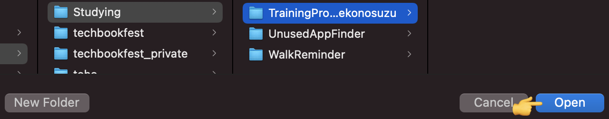

# 開発環境の構築

Kotlin 研修おつかれさまでした！

これから待ち受ける実習課題にそなえ、 Kotlin で Android 開発を行うための環境構築について記載します。

## ゴール

* サンプルプロジェクトをclone する
* clone したサンプルプロジェクトを Android Studio で読み込む
* サンプルアプリを実行する

## 想定する事前準備

以下はあらかじめ用意されていることを想定

* ターミナルで git コマンドが実行できるようになっていること
* Android Studio (バージョン Bumblebee 2021.1.1 以降) がインストールされていること

## サンプルプロジェクトを clone する

* サンプルプロジェクトは以下
  * https://github.com/access-company/TrainingProject_Nekonosuzu
* ターミナルを開き、任意の位置に clone する
  * 以下のようなコマンドを打つ
    ```bash
    $ git clone https://github.com/access-company/TrainingProject_Nekonosuzu.git
    ```
* 正常に完了すると、リポジトリのソースコード一式がダウンロードされる

## clone したサンプルプロジェクトを Android Studio で読み込む

* Android Studio を起動し、Open を選ぶ


* ファイルエクスプローラが起動するので、先程 clone した TrainingProject_Nekonosuzu のフォルダを選び Open する
* ファイルではなくフォルダを選ぶ



* 自動的にビルドが始まり、必要なもののダウンロード等が始まる

## サンプルを実行しよう

* Android 端末を PC に USB で接続しよう
* Android Studio の Run メニューからサンプルアプリを実行しよう


* うまく動いただろうか
* 実機がなくても、エミュレーターを作成して実行することができる
  * 余裕があれば調べてやってみよう
* それでは、実習にのぞんでください！
