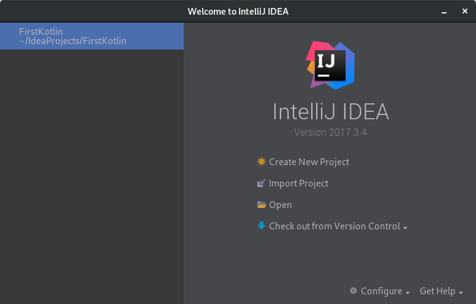
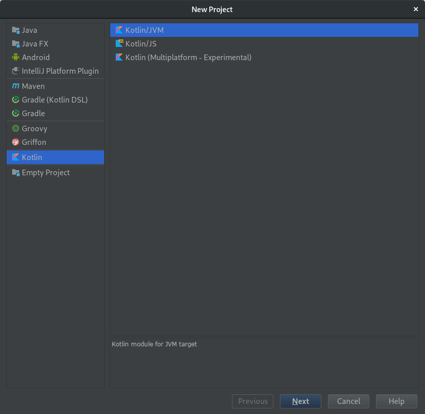
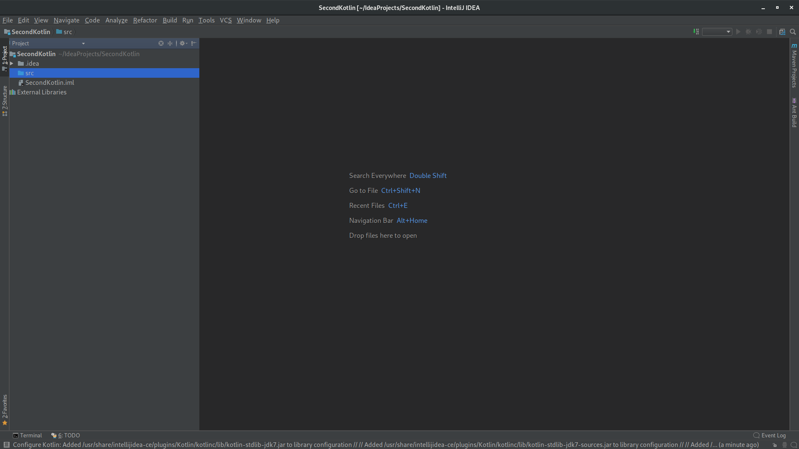

# 開発環境の構築

Kotlin を用いた開発を行うための環境構築について記載します。

## ゴール

* IntelliJ IDEA を使って "Hello World" を出す。

## IntelliJ IDEA の導入

* IntelliJ IDEA をインストールします。
以下、公式サイトからダウンロードして導入する手順を紹介します。

### 公式サイトからダウンロード

* [JetBrains 公式のダウンロードページ](https://www.jetbrains.com/idea/download/) からダウンロードしてインストールします。

## 新規プロジェクトの作成

* IntelliJ IDEA を起動し、「Create New Project」を選択します。


IntelliJ IDEA を起動したところ

* Kotlin を選択します。


Kotlin を選んだところ

* 適当に Project 名を付け、Finish を選択します。


SecondKotlin と名付けたところ


プロジェクトが作成されたところ

## ソースコードの追加

* 画面左上の「src」を右クリックし、「New → Kotlin File/Class」を選択します。
* ファイル名を「main.kt」として、OK を押します。

  
main.kt を作るところ

## ソースコードを書く 

* 以下のようなコードを書いてみましょう。

```kotlin
fun main(args: Array<String>) {
        println("Hello World!")
}
```

## ビルドして実行する

* main.kt をクリックして選択します。
* メニューから「Run」→「Run」と選択します。  
ファイルがコンパイルされ、実行が始まります。

  
プログラムを実行したところ
