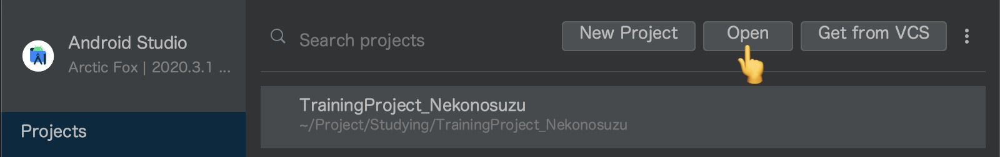
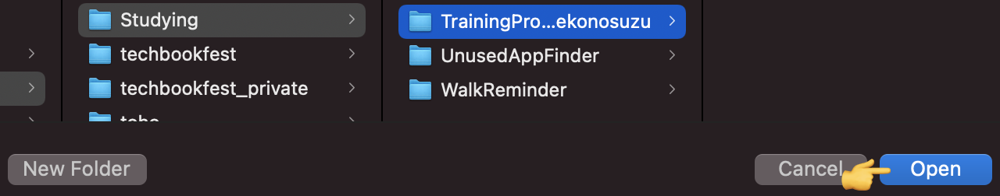

# 開発環境の構築

Kotlin を用いた開発を行うための環境構築について記載します。

## ゴール

* サンプルプロジェクトをclone する
* clone したサンプルプロジェクトを Android Studio で読み込む
* SampleTest を実行し、welcome メッセージを確認する
* Sample.kt を編集し、hello world を出す関数を定義する
* hello world を出す関数を SampleTest クラスから呼び出す

## 想定する事前準備

以下はあらかじめ用意されていることを想定

* ターミナルで git コマンドが実行できるようになっていること
* Android Studio (バージョン 4 以降) がインストールされていること

## サンプルプロジェクトを clone する

* 本研修で使用するサンプルプロジェクトを用意しておいた
  * [サンプルプロジェクトはココ](https://github.com/access-company/KotlinTraining)
* ターミナルを開き、任意の位置に clone する
  * 以下のようなコマンドを打つ
    ```bash
    $ git clone https://github.com/access-company/KotlinTraining.git
    ```
* 正常に完了すると、リポジトリのソースコード一式がダウンロードされる

## clone したサンプルプロジェクトを Android Studio で読み込む

* 無事に clone は済んだだろうか
* 次に clone したソースコードを Android Studio で読み込む
* Android Studio を起動し、「Open an exisiting Android Studio project」を選ぶ

  
↑ Android Studio を開いたところ

* ファイルエクスプローラが起動するので、先程 clone したところを選ぶ

  
↑ clone したサンプルプロジェクトを選ぶ (アイコンが緑の丸っぽいのを選ぶ)

* 選ぶと自動的にビルドが始まり、必要なもののダウンロード等が始まったりする

## SampleTest を実行し、welcome メッセージを確認する

* SampleTest クラスを見つけてみよう
* 見つけたら、右クリックで選択し、`Run 'SampleTest'` を選択
* welcome メッセージが出るかな

## Sample.kt を編集し、hello world を出す関数を定義する

* Sample.kt を探し、以下のようなコードを書いてみましょう。

```kotlin
fun hello() {
    println("Hello World!")
}
```

## `hello` を SampleTest クラスから呼び出す

* SampleTest を編集し、先ほど Sample.kt に定義した `hello` を呼び出してみよう
* うまく呼び出せただろうか
